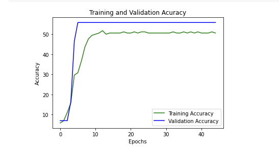

# Retina_image_classification_

_Purpose_ :
      Diabetic retinopathy (DR) is a common diabetes complication that occurs when the retina’s blood vessels are damaged due to high blood sugar levels, resulting in swelling and leaking of the vessels [1]. In an advanced DR stage, the vision may be lost completely. The percentage of blindness worldwide resulting from DR is 2.6% [2]. Therefore, diabetes patients need regular screening of the retina to detect DR early, manage its progression and avoid the risk of blindness. 
 
 Classess :[ No DR,    Mild,   Moderate, Severe,  Proliferate  ]![image]

Training :

  Given problem is to train the dataset which contain 5 classes so that model can able to distinguish the classes once model is trained on given dataset 

Data distrubution 

| |

_Training and validation results_ :

| || |

True positive rate and False positive rate for each class 

| |

Next steps to improve this results:

1.Used augmentations library for more augmentations to eliminate class imbalance problem 

2.Use deeper or wider networks such as resent 152, inception, wide resnet etc. required gpus to train on these architectures 

3. Use cutmix and aumix augmentations to improve the F1 score
